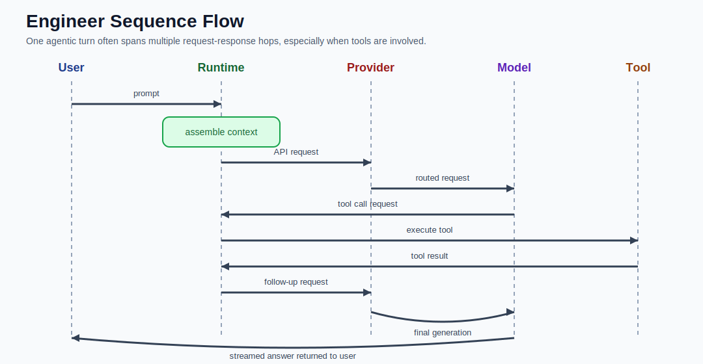

# Codex / LLM Workflow for Engineers

This version is written for engineers who want a more implementation-oriented view of the stack and its tradeoffs.

The model names are still examples. The mechanics are the point.

Use this guide together with:

- [workflow_overview.md](./workflow_overview.md) for the general explainer
- [workflow_glossary.md](./workflow_glossary.md) for term definitions
- [engineer_request_trace.md](./engineer_request_trace.md) for one traced request from prompt to final answer
- [engineer_debugging_runbook.md](./engineer_debugging_runbook.md) for practical troubleshooting patterns
- [provider_agnostic_schema_patterns.md](./provider_agnostic_schema_patterns.md) for common request and response shapes



## System Boundary

The cleanest way to reason about the workflow is to split it into three layers:

| Layer | Responsibility | Typical concerns |
|---|---|---|
| Local runtime | prompt capture, context assembly, tool execution, streaming UX, local state | file access, tool permissions, retries, session persistence |
| API provider | auth, rate limits, request validation, routing, metering, streaming transport | quotas, model selection, caching, usage accounting |
| Model service | tokenization, forward pass, decoding loop | latency, context length, KV cache, output quality |

If you blur these layers together, debugging gets harder very quickly.

## Request Lifecycle

For a single turn, the runtime usually performs something close to the following:

1. Accept the latest user message.
2. Resolve active system and developer instructions.
3. Load enough prior conversation state to rebuild the working context.
4. Attach relevant tool results, retrieved documents, or file excerpts if the workflow requires them.
5. Serialize that state into the provider's request schema.
6. Authenticate the request with the API key.
7. Send the request to the provider.
8. Receive a streamed response or a tool call request.
9. If tools are requested, execute them in the runtime and send results back as another model turn.
10. Persist the updated session state locally.

Conceptually:

```text
turn_n_request =
  instructions
  + relevant_history
  + latest_user_input
  + tool_results_if_any
  + retrieval_context_if_any
```

If you prefer a concrete walkthrough instead of abstract steps, see [engineer_request_trace.md](./engineer_request_trace.md).

## What the Runtime Actually Owns

Codex or a similar agent runtime is not doing inference. It is doing orchestration.

In practice, that orchestration often includes:

- selecting the model and provider
- deciding how much history to include
- truncating or summarizing old context
- formatting tool schemas
- executing shell or file tools
- handling retries and failures
- rendering incremental output to the user
- storing session state on disk

This is why agent behavior is often more a property of runtime design than of the raw model alone.

## Representative Request Shape

The exact schema depends on the provider, but the shape is usually conceptually similar to:

```json
{
  "model": "example-model",
  "instructions": "system or developer guidance",
  "input": [
    {"role": "user", "content": "Explain this stack trace"},
    {"role": "tool", "content": "Contents of ./logs/app.log"},
    {"role": "user", "content": "Now suggest a fix"}
  ],
  "tools": [
    {"name": "read_file", "description": "Read a local file"}
  ],
  "stream": true
}
```

Important point: the "conversation" is usually just structured input for the current request. Memory is reconstructed state, not a persistent hidden mental model.

## Model Inference Path

Once the request reaches the model service, the high-level path looks like this:

1. Convert text into tokens.
2. Map tokens into embeddings.
3. Run the embeddings through transformer layers.
4. Produce logits for the next token.
5. Apply decoding policy.
6. Emit the selected token.
7. Append that token to the sequence.
8. Repeat until a stop condition is reached.

This is inference. No model weights are being updated during your request.

## Why KV Cache Matters

For engineers, one of the most useful mental models is the distinction between recomputing context and reusing intermediate state.

During decoding, transformer inference can reuse cached key/value tensors for previously processed tokens. That is part of why generating token `n+1` is cheaper than recomputing the entire sequence from scratch inside the same request.

Provider-side cached tokens are related but not identical. "Cached tokens" in usage reporting generally refer to billing or serving optimizations for repeated prompt prefixes across requests, not just the model's internal per-request KV cache.

## Tool Calling Is a Control Loop

With tools enabled, the workflow becomes a runtime-mediated control loop rather than a single request-response exchange.

```text
user input
  ->
runtime sends context to model
  ->
model requests tool or emits answer
  ->
runtime executes tool
  ->
runtime returns tool result to model
  ->
model continues generation
  ->
runtime returns final answer
```

The model is not usually opening files or running shell commands directly. It is producing structured output that the runtime interprets as a tool request.

## Context Window Engineering

Context assembly is one of the main engineering levers in agent systems.

What goes into the window often includes:

- system instructions
- developer instructions
- recent chat history
- retrieved documentation
- file excerpts
- tool outputs
- the latest user message

Tradeoffs:

- more context can improve accuracy, but increases cost and latency
- irrelevant context can degrade answer quality
- long tool outputs can crowd out more useful tokens
- summarization reduces size, but can destroy details needed for exact reasoning

In practice, many failures that look like "the model is dumb" are context engineering failures.

## Latency and Cost Drivers

The main factors are usually:

- input token count
- output token count
- model size and serving tier
- tool round-trips
- retrieval round-trips
- streaming overhead
- provider-side queuing or rate limits

The first answer token is often delayed by prompt processing, scheduling, and any prefill cost for the input context. Long prompts tend to hurt time-to-first-token.

## Why the System Feels Stateful

The model is stateless across separate requests.

The runtime creates the illusion of state by doing two things:

1. persisting prior interaction state
2. replaying or summarizing that state into the next request

This distinction matters because it explains common failures:

- old facts disappear because they were dropped from context
- behavior changes because instructions were reordered or truncated
- tool outputs influence later turns only if they were preserved in reconstructed context

## Failure Modes Engineers Actually Hit

### Context Overflow

Too much history or tool output pushes important information out of the active window.

### Instruction Collisions

System, developer, and user instructions conflict, producing unstable behavior.

### Tool Schema Drift

The runtime expects one tool-call format while the model emits another.

### Retrieval Pollution

Low-quality retrieved documents add noise and reduce answer quality.

### Non-Deterministic Outputs

Sampling, model updates, or small prompt changes can shift outputs enough to break brittle downstream assumptions.

### Streaming Misinterpretation

A partial streamed answer is treated as final before the model or runtime has completed the full loop.

## Debugging Checklist

When behavior is off, inspect the system in this order:

1. What exact payload was sent to the provider?
2. Which instructions were active?
3. What history was included or excluded?
4. Were tool results serialized back into the next model turn correctly?
5. Did retrieval inject irrelevant context?
6. Did token limits or truncation drop key information?
7. Was the observed issue model behavior, or runtime orchestration behavior?

This ordering matters. Many "LLM bugs" are really packaging bugs.

## What to Instrument

If you are building or operating a system like this, the minimum useful observability surface is:

- raw request payload shape, with secrets redacted
- effective instructions after composition
- token counts for input and output
- truncation or summarization events
- tool call requests and tool results
- time to first token
- total turn latency
- provider errors, retries, and rate-limit events

Without this, debugging becomes guesswork.

## Token Usage Categories

Common categories include:

- `input`: everything sent into the model
- `output`: everything generated by the model
- `cached`: reused prompt material if the provider supports prompt caching
- `reasoning`: provider-specific extra inference budget or internal reasoning accounting

These labels are not fully standardized across providers, so they should be read as provider-defined accounting rather than universal architecture primitives.

## Security and Operational Notes

From an engineering standpoint, the API key and tool layer are usually more sensitive than the prompt itself.

Points to keep in mind:

- the API key grants service access and may incur billable usage
- local tool execution can expose files, secrets, or infrastructure if poorly scoped
- session storage may contain sensitive prompts, outputs, and tool traces
- retrieval systems can accidentally surface private data into model context

The model may be the visible part of the system, but the runtime and data path are where many operational risks live.

## Practical Takeaway

For engineers, the right mental model is:

- the model is a probabilistic token generator
- the provider is a managed serving and accounting layer
- the runtime is the orchestration system that makes the whole workflow useful

If you want better system behavior, the highest-leverage places to look are usually context assembly, tool design, retrieval quality, and request/response tracing.
