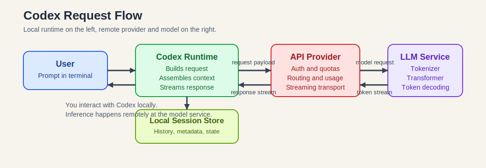
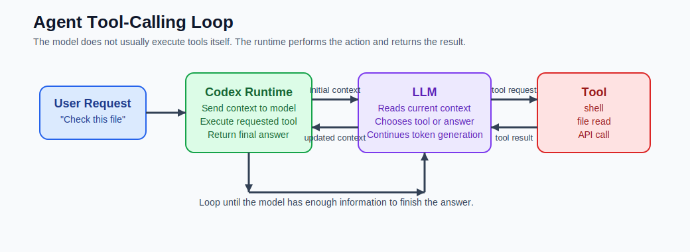
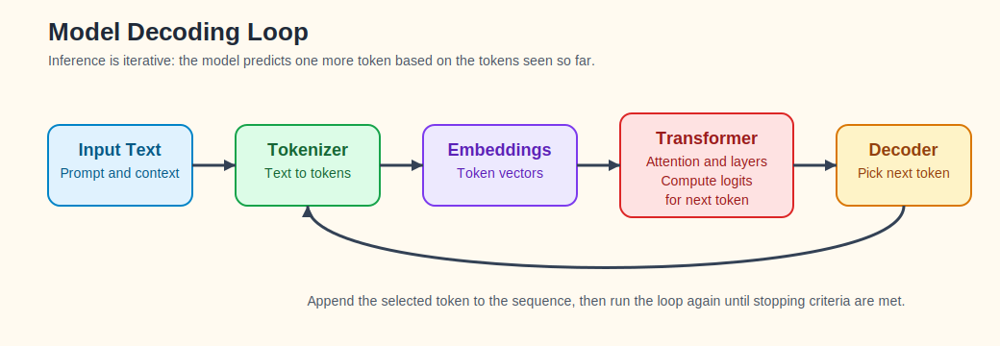

# Understanding the Codex / LLM Workflow

This document explains what happens between a prompt you type into Codex and the answer that comes back.

The model names in this document are examples only. The workflow is the important part.

## In This Guide

- [The Short Version](#the-short-version)
- [End-to-End View](#end-to-end-view)
- [What Lives Where](#what-lives-where)
- [What Happens When You Ask a Question](#what-happens-when-you-ask-a-question)
- [How Tool Calling Changes the Flow](#how-tool-calling-changes-the-flow)
- [What Happens Inside the Model](#what-happens-inside-the-model)
- [Understanding Token Usage](#understanding-token-usage)
- [Common Misunderstandings](#common-misunderstandings)

For short definitions of terms such as `context window`, `inference`, and `tool call`, see [workflow_glossary.md](./workflow_glossary.md).

For a more implementation-oriented version aimed at engineers, see [workflow_engineer_view.md](./workflow_engineer_view.md).

## The Short Version

Codex is not the model.

Codex is the local runtime that:

- accepts your prompt
- assembles instructions and conversation history
- sends requests to an API provider
- receives streamed tokens back
- optionally runs tools
- stores local session state

The LLM is the remote model service that:

- accepts tokens as input
- computes the next-token probabilities
- emits tokens one step at a time

## Mental Model

If you only keep one distinction in mind, keep this one:

- Codex is the thing coordinating work.
- The provider is the thing exposing the model as a service.
- The model is the thing predicting the next token.

## End-to-End View



At a high level:

1. You type a prompt in a local client such as Codex CLI.
2. Codex builds the request payload.
3. The API provider authenticates the request with your API key.
4. The provider routes the request to a model.
5. The model runs inference and generates output tokens.
6. Tokens stream back to Codex.
7. Codex renders the answer and stores session history locally.

## What Lives Where

| Layer | Main job | Typical examples |
|---|---|---|
| Local runtime | collect input, build context, run tools, render output | Codex CLI, local shell, session files |
| API provider | authenticate, route, meter, stream | hosted API gateway, usage accounting |
| Model service | tokenize, run transformer layers, decode tokens | LLM inference server |

### Local Machine

These parts usually run on your computer:

- terminal or editor UI
- Codex CLI or agent runtime
- local session storage
- tool execution such as shell commands, file reads, or patches

Codex is responsible for orchestration, not for neural network inference.

### Remote Provider

These parts usually run on the provider side:

- API gateway
- authentication and quota checks
- request routing
- model serving infrastructure
- token usage accounting

### Model Service

This is the actual LLM:

- tokenizer
- embeddings
- transformer layers
- decoding loop

That service turns input tokens into output tokens.

## What Codex Actually Does

Codex is best thought of as an agent runtime wrapped around an LLM API.

Typical Codex responsibilities:

- manage conversation state
- inject system and developer instructions
- include recent chat history
- decide when tool output should be sent back to the model
- stream partial responses to you
- track local files and session metadata

Tools similar in spirit include:

- ChatGPT UI
- Cursor
- Claude Code
- Copilot Chat

The exact UX differs, but the pattern is similar: local client plus remote model.

## One Request in Plain English

When you type a question into Codex, you are not talking directly to a neural network. You are talking to a local runtime that packages your question, adds the relevant instructions and history, sends that package to a remote model service, and then renders the streamed result back to you. If tools are needed, the runtime handles those actions and feeds the results back into the model loop.

## What the API Key Does

Example:

```bash
export ASKSAGE_API_KEY=...
```

An API key is not part of the model. It is part of the service boundary.

The key typically:

- authenticates the caller
- ties requests to an account or workspace
- enforces quotas or permissions
- attributes usage for billing or reporting

## What Happens When You Ask a Question

Example prompt:

```text
Explain Kubernetes operators
```

The actual flow is usually closer to this:

1. Codex captures your new prompt.
2. Codex gathers the active instructions.
3. Codex reconstructs the current context window from prior messages and other inputs.
4. Codex packages that into an API request.
5. The API provider authenticates the request with your API key.
6. The provider routes the request to the chosen model.
7. The model tokenizes the input and runs inference.
8. The model emits one token, then another, then another.
9. The provider streams those tokens back.
10. Codex renders the text as it arrives.
11. Codex stores the updated conversation state locally.
12. Usage metadata is recorded for the request.

## How Tool Calling Changes the Flow

The simple "prompt in, answer out" story is incomplete once tools are involved.



A more realistic agent loop looks like this:

1. You ask for something.
2. Codex sends the current context to the model.
3. The model may decide it needs a tool instead of answering immediately.
4. Codex executes that tool locally or through another service.
5. Codex sends the tool result back to the model as additional context.
6. The model continues generation using that new information.
7. Codex returns the final answer to you.

This is why agent workflows feel more capable than plain chat completion. The model is still doing token prediction, but the runtime keeps feeding it fresh state from tools and external systems.

## What an LLM Is

An LLM, or large language model, is a neural network trained to predict the next token in a sequence.

That sounds simple, but it scales into useful behavior because of:

- very large training datasets
- very large parameter counts
- transformer architectures
- large context windows
- decoding and serving infrastructure

The core loop is still:

> Given the tokens so far, predict the next token.

## What Tokens Are

Tokens are model-readable pieces of text.

They are not exactly words and not exactly characters.

Examples:

| Text | Approximate token count |
|---|---|
| `hello` | 1 |
| `Kubernetes` | often more than 1 |
| `The quick brown fox jumps.` | several |

Different tokenizers split text differently, so token counts are approximate unless measured by the specific model tokenizer.

## What Happens Inside the Model



From a workflow perspective:

1. Input text is tokenized.
2. Tokens are converted into vectors called embeddings.
3. Those vectors pass through many transformer layers.
4. The model produces a probability distribution over possible next tokens.
5. A decoding strategy selects the next token.
6. That new token is appended to the sequence.
7. The loop repeats until the model stops.

Important detail: the model does not usually generate the whole response in one shot. It generates one token at a time in a decoding loop.

## Inference vs Training

Inference is the live use of the model at request time.

Training:

- updates model weights
- happens offline before you use the model
- requires large-scale compute over long periods

Inference:

- uses the already-trained weights
- processes your request in real time
- produces output tokens for the current prompt

When you use Codex, you are interacting with inference, not training.

## Why the Model Feels Stateful

The model itself is stateless across requests.

The feeling of memory comes from the runtime rebuilding context each time.

Conceptually:

```text
system instructions
+ conversation history
+ latest user message
+ tool results if any
= current context window
```

That full context is sent with the new request, or reconstructed from cached state managed by the provider or runtime.

This is why "memory" is usually a property of the workflow, not a property of the raw model.

## Understanding Token Usage

Example categories:

```text
total=...
input=...
cached=...
output=...
reasoning=...
```

### Input Tokens

These are the tokens sent into the model, including:

- system instructions
- developer instructions
- user messages
- conversation history
- tool results

### Output Tokens

These are the tokens the model generated for the response.

### Cached Tokens

These are tokens reused from previously processed context, depending on the provider's caching behavior.

### Reasoning Tokens

Some providers expose a separate reasoning or internal-compute category. This usually means extra generation or inference budget was used beyond the visible answer.

The exact reporting categories vary by provider.

## Why Sessions Exist Locally

Codex commonly stores local session state so it can:

- restore prior conversations
- reconstruct context
- show history
- resume work across turns

Example local path:

```bash
~/.codex/sessions
```

Local storage is part of the runtime layer, not the model layer.

## The Bigger AI Stack

Modern agentic systems usually look more like this:

```text
Human
  ->
Local runtime or agent
  ->
LLM API
  ->
Model inference
  ->
Tool calls or external systems
  ->
Updated context
  ->
LLM
  ->
Final response
```

This architecture enables:

- code generation
- shell execution
- retrieval and search
- workflow automation
- infrastructure operations

## Common Misunderstandings

### "Codex is the model"

Usually false. Codex is the runtime or interface layer around the model.

### "The model remembers everything forever"

False. The runtime reconstructs context from saved history and current inputs.

### "The model directly runs shell commands"

Usually false. The runtime executes tools. The model requests actions; Codex or another orchestrator performs them.

### "The answer appears all at once"

False. The model normally decodes one token at a time and the client streams those tokens.

## Key Insight

The model's primitive operation is still next-token prediction.

What makes the overall system useful is the combination of:

- prompt and context assembly
- large-scale model inference
- tool integration
- local runtime orchestration
- retrieval and external system access

That combined system is what people usually experience as an "AI agent."
