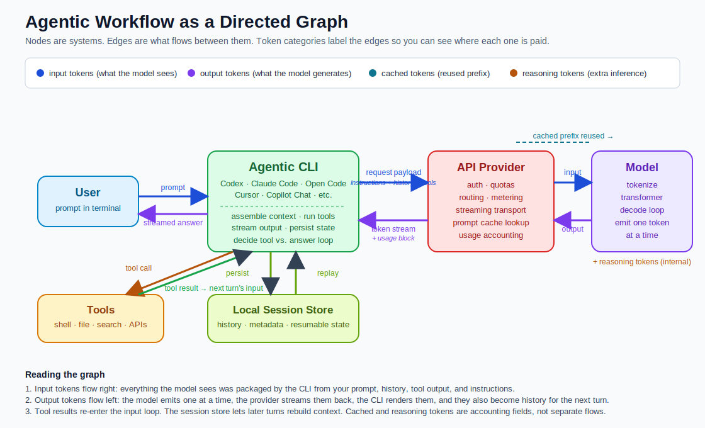
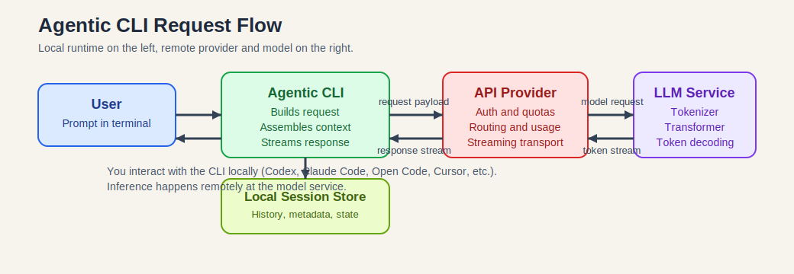

# Workflow Overview

What actually happens between the moment you type a prompt into an **Agentic CLI** and the moment the answer streams back.

The shape is the same whether the CLI is Codex, Claude Code, Open Code, Cursor, Copilot Chat, or any other agent-style client. The product names differ; the workflow does not.

For one-line definitions of terms used below, see [workflow_glossary.md](./workflow_glossary.md).

## In one picture



Five nodes, a handful of labeled edges. Input tokens flow into the model, output tokens stream back, tools loop through the CLI, session state persists locally.

## The three layers, and why they matter

| Layer | Job | Examples |
|---|---|---|
| **Agentic CLI** (local) | capture input, assemble context, run tools, render output, persist state | Codex, Claude Code, Open Code, Cursor, Copilot Chat |
| **API Provider** (remote) | authenticate, route, meter, stream | hosted gateways, prompt caching, usage accounting |
| **Model** (remote) | tokenize, run transformer, decode tokens | LLM inference servers |

If you only keep one distinction, keep this: **the CLI is not the model**. The CLI is the orchestration layer; the model just predicts the next token.

## A single turn, step by step



1. You type a prompt.
2. The CLI gathers instructions + recent history + tool schemas + your prompt.
3. The CLI sends that bundle to the provider.
4. The provider authenticates and routes the request to the chosen model.
5. The model tokenizes, runs inference, and emits tokens one at a time.
6. The provider streams tokens back.
7. The CLI renders them as they arrive and stores the new state locally.

## What changes when tools are in the loop


The model can decide it needs a tool before answering. When it does, it emits a *structured tool call* — not an executed action. The CLI runs the tool (shell, file read, search, API call), wraps the result, and sends it back as the input for the next model turn. The loop continues until the model has enough to finish.

This is the difference between "chat completion" and "agent." Same model, more loops.

## What happens inside one inference call


The model itself is also a loop. For each output token:

1. Tokens become embeddings.
2. Embeddings pass through transformer layers.
3. The model produces a probability distribution over possible next tokens.
4. A decoding strategy selects one.
5. That token is appended and the loop runs again until a stop condition.

The model doesn't generate the whole response at once. It decodes one token at a time.

## Tokens, briefly

Tokens are model-readable chunks of text — not quite words, not quite characters.

The provider's usage block usually reports a few categories:

| Category | What it means |
|---|---|
| `input` | everything sent into the model (instructions, history, tool output, your prompt) |
| `output` | everything the model generated |
| `cached` | tokens the provider reused from a previously processed prompt prefix |
| `reasoning` | extra inference budget some providers expose for internal reasoning |

These are *accounting* fields. They don't correspond to separate flows in the diagram — they're labels on the same input/output edges.

## Why the system feels stateful

The model is stateless. Every request is processed fresh.

The feeling of memory comes from the CLI **rebuilding context every turn**:

```
system instructions
+ developer instructions
+ conversation history
+ latest user message
+ tool results (if any)
= the request the model actually sees
```

Local session storage (e.g. `~/.codex/sessions`, similar paths for other CLIs) is what lets the CLI reconstruct that bundle next time.

## Common misunderstandings

- **"The CLI is the model."** No. The CLI is the local orchestrator. The model is a remote service.
- **"The model remembers everything."** No. The CLI rebuilds context from saved history.
- **"The model runs shell commands."** No. The model emits a structured tool request; the CLI executes it.
- **"The answer arrives all at once."** No. The model decodes one token at a time and the CLI streams them.

## Going deeper

If you want the engineer's view — KV cache, context window engineering, traced requests, schema patterns, debugging — see [workflow_engineer_view.md](./workflow_engineer_view.md) and the `deep_dives/` folder.
